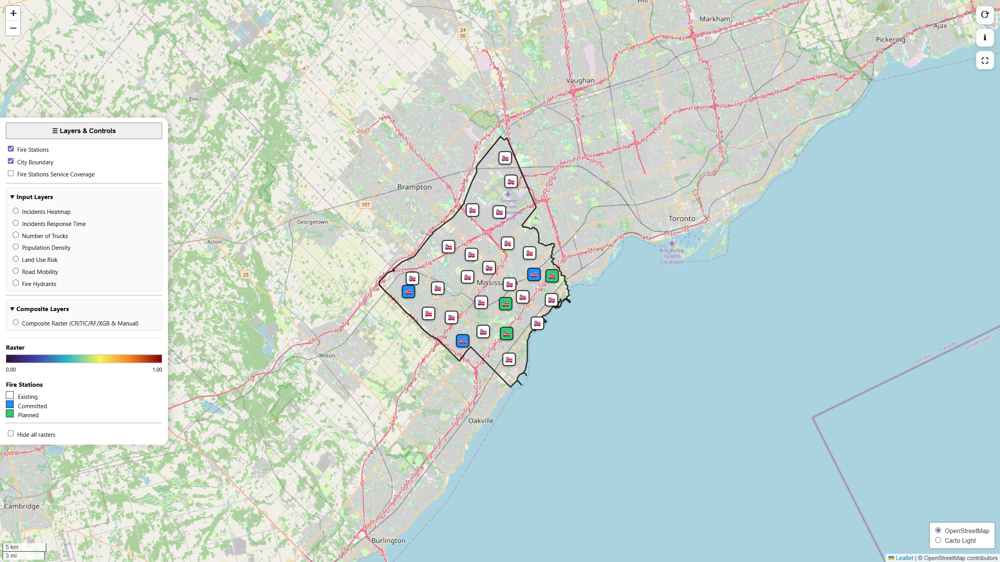

# Interactive Mapping Tool for Fire Station Planning

This repository provides the open-source interactive webmapping platform developed for the study:

**GeoAI and Multi-criteria Evaluation for Risk-informed Urban Fire Station Planning**

## Repository and Webmap

- **GitHub repository:** [Interactive Mapping Tool for Fire Station Planning](https://github.com/Interactive-Urban-Mapping/Interactive_Mapping_Fire_Station_Planning)
- **Interactive webmap:** [Launch the interactive webmap](https://interactive-urban-mapping.github.io/Interactive_Mapping_Fire_Station_Planning/)

The tool supports visualization and comparison of fire station planning scenarios using raster indicators, composite risk surfaces, and travel-time coverage layers. It was developed for the City of Mississauga, Canada, but the workflow can be adapted to other municipalities using equivalent local datasets.

## Overview

Fire station planning is often evaluated using travel-time coverage targets, such as four-minute urban response benchmarks. However, other factors that influence emergency service demand, including historical incident patterns, population density, land-use risk, road-network mobility, and fire hydrant availability, are not always integrated consistently into planning analysis.

This repository implements an interactive GeoAI multi-criteria evaluation platform that allows users to explore individual indicators, compare composite weighting methods, and examine how station expansion scenarios affect service coverage and priority areas.

## Interface Preview



## Main Features

The webmap allows users to:

- visualize individual raster indicators;
- display CRITIC, RF, XGB, and user-defined composite raster indicators;
- define indicator weights and generate user-defined composite raster indicators;
- compare scenario results using interactive charts; and
- compare station expansion scenarios across alternative weighting configurations and planning assumptions.

The platform is intended for long-term planning and scenario evaluation rather than real-time operational dispatch.

## Data and Indicators

The webmap visualizes the following indicators:

- Travel-time coverage
- Historical incidents heatmap
- Incident response time
- Number of engines dispatched
- Population density
- Land-use risk
- Road-network mobility
- Fire hydrant density

Composite raster surfaces are generated using:

- **CRITIC**
- **RF**
- **XGB**
- **User-defined weighting**

## Repository Structure

```text
Interactive_Mapping_Fire_Station_Planning/
├── index.html          # Main webmap page and user interface
├── app.js              # Leaflet map logic, layer controls, charts, and interactive functions
├── README.md           # Repository overview and usage notes
├── LICENSE             # Open-source license
├── assets/             # Interface images and supporting visual assets
└── data/               # Processed visualization layers and model-weight files
    ├── raster tile folders
    ├── value tile folders
    ├── GeoJSON layers
    ├── scenario coverage layers
    ├── weights_critic.json
    ├── weights_rf.json
    └── weights_xgb.json

## Documentation

Additional workflow documentation is organized in the `docs/` folder:

- `tile_generation.md` — raster tile generation workflow
- `geojson_layers.md` — GeoJSON layer documentation
- `data_dictionary.md` — spatial layer summary
- `adapting_to_other_cities.md` — workflow adaptation guidance
